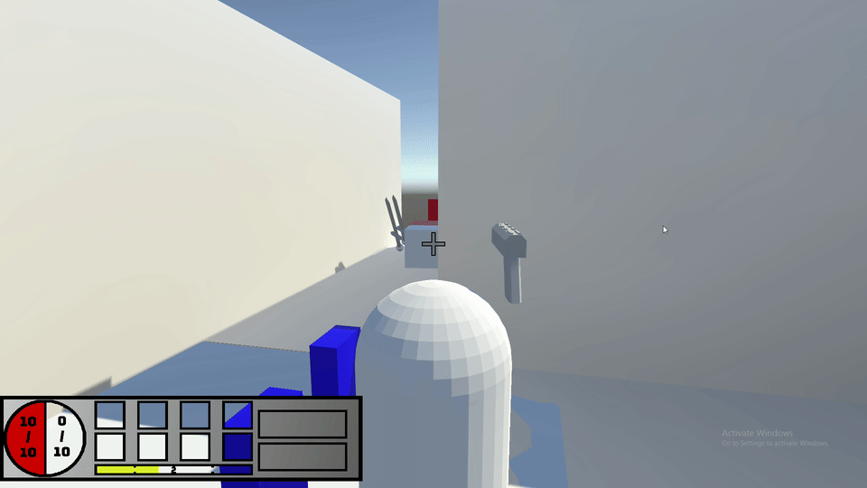
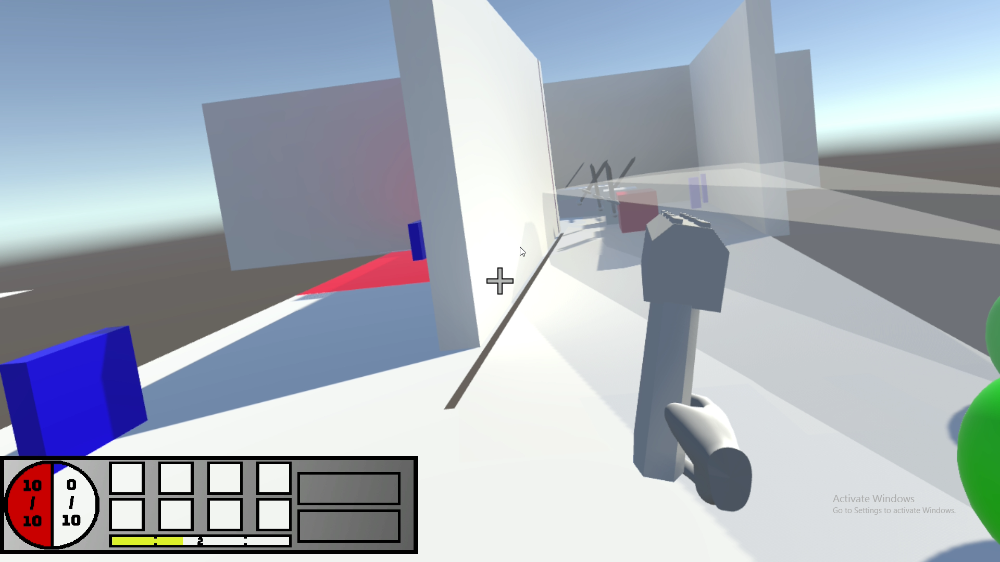
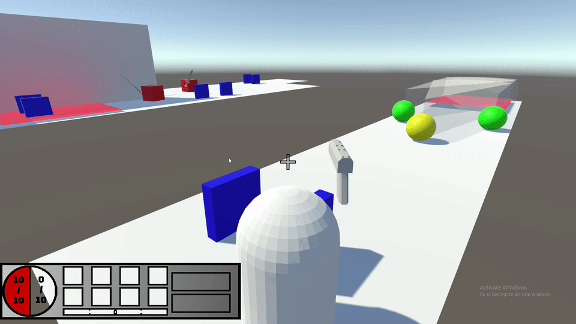

# TowerDefenseVR
 A Tower Defense game built with Unity featuring support for both desktop and VR gameplay.

### **Install**
##### playing
Clone the repository, open the TowerDefenseVR - Unity Editing folder, open the solution with unity. Must have blender installed in order to have working models and prefabs. Go to file, select build, choose the build location, and run the .exe once the file is made.
VR will start automatically if a Oculus Headset is connected, otherwise the game will boot into desktop mode.

##### Development
Clone the repository, open the TowerDefenseVR folder, open the solution with unity. Must have Blender installed in order to have working models and prefabs.

### Screenshots and GIFs

